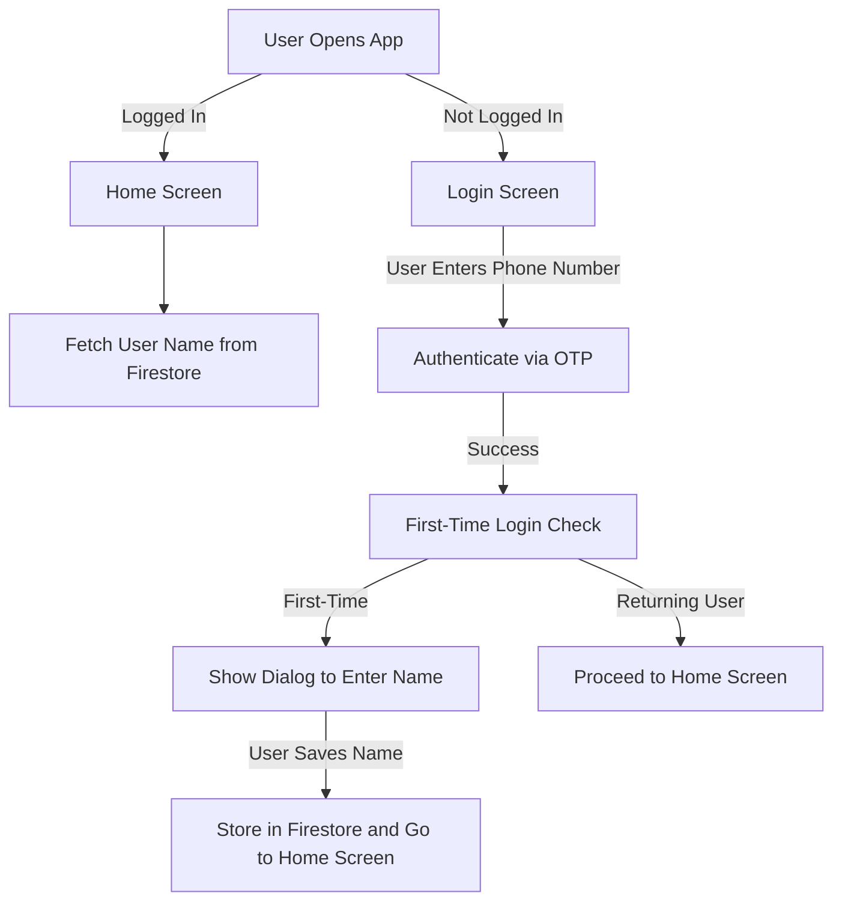

# Demo App - Authentication Flow

## Overview
This demo showcases the authentication flow of the app, explaining how users log in and how their profile information is managed. Below, you'll find a step-by-step guide along with screenshots and videos demonstrating the functionality.

## Features
- **Phone Number Authentication** (Firebase Authentication)
- **Firestore Integration** (User data storage)
- **Personalized Home Screen** (Fetches and displays user details)
- **First-Time User Prompt** (Requests user name if not available)

## Flow Diagram


## App Flow
### 1. **Launching the App**
- If the user is **already logged in**, they are redirected to the **Home Screen**.
- If not, they are taken to the **Login Screen**.

### 2. **Authentication Video Demo**
📽️ [Watch Demo Video](videos/auth_demo.mp4)

## Setup Instructions
1. Clone the repository:
   ```bash
   git clone https://github.com/DhruvalGorasiya/phone_authentication
   ```
2. Navigate to the project folder:
   ```bash
   cd demo-auth-app
   ```
3. Install dependencies:
   ```bash
   flutter pub get
   ```
4. Run the app:
   ```bash
   flutter run
   ```

## Technologies Used
- **Flutter** (Framework)
- **Firebase Authentication** (Phone number login)
- **Firestore** (User data storage)
- **Provider** (State management)

## Conclusion
This demo highlights the authentication process, ensuring a smooth user experience with Firebase authentication and Firestore integration. If you have any questions or need modifications, feel free to reach out!

---
📌 **Repository:** [GitHub Repo](https://github.com/DhruvalGorasiya/phone_authentication)

